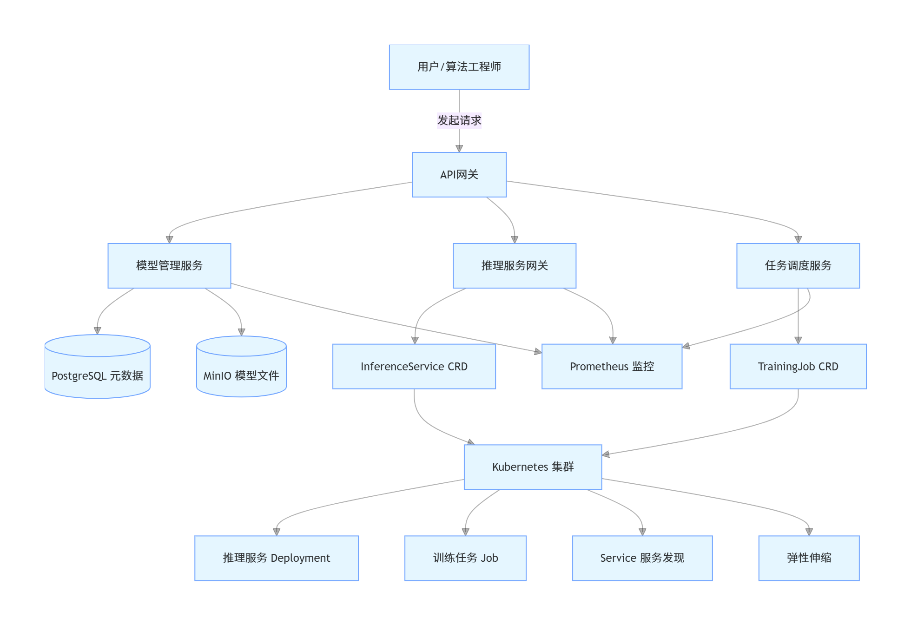

# 基于Go的AI服务平台

## 1、kubeai 是基于Go语言+kubernetes自研的极简AI平台，三大核心模块形成「模型生命周期→训练调度→在线推理」的完整闭环，定位与交互如下：


| 模块             | 核心定位     | 核心能力                                                                  | 与其他模块交互                                                                     |
| :--------------- | :----------- | :------------------------------------------------------------------------ | :--------------------------------------------------------------------------------- |
| **模型管理服务** | 平台数据底座 | 模型注册 / 版本管理 / 元数据存储 / MinIO 文件管理，替代 MLflow 核心能力   | 为**推理网关**提供部署用的模型文件与元数据；为**任务调度**提供训练后模型的入库入口 |
| **推理服务网关** | 在线服务入口 | 基于 K8s Operator（CRD+Controller）实现模型声明式部署、灰度发布、弹性伸缩 | 从**模型管理**拉取模型；接收外部推理请求；将服务状态同步给平台                     |
| **任务调度服务** | 离线训练中枢 | 基于 K8s Job/TrainingJob CRD 管理训练任务、状态跟踪、日志收集             | 训练完成后将模型上传至**模型管理**；接收算法团队训练任务                           |

***架构***



***核心数据流***

1. **训练流**：提交训练任务→任务调度服务下发任务→redis stream 队列->推理网关消费任务->创建K8s trainingJob 执行训练→生成模型→上传模型管理服务
2. **部署推理流**：提交部署推理服务任务→任务调度服务下发任务->redis stream 队列->推理网关消费任务->从模型管理拉取模型→K8s inferenceservice创建 Deployment/Service/ingresss→对外提供推理 API
3. **推理流**：提交推理任务->推理网关->ingree路由具体实例进行推理→返回推理结果

## 2、核心功能

### 1. 模型管理服务（替代 MLflow）

* 模型注册 / 版本管理 / 元数据存储
* MinIO 分布式模型文件存储
* 模型状态管理（active/archived）

### 2. 推理服务网关（K8s Operator）

* InferenceService 自定义资源
* 声明式部署、灰度发布、弹性伸缩（HPA）
* 自动生成 Deployment/Service/Ingress/HPA

### 3. 任务调度服务（离线训练）

* TrainingJob 自定义资源
* PyTorch/TensorFlow 训练任务编排
* 任务状态同步、日志实时拉取

## 3、技术栈

* 后端：Go、Go-zero、GORM、client-go、Kubebuilder
* 存储：PostgreSQL、Redis、MinIO
* 云原生：K8s、CRD/Controller、Job/HPA/Ingress-Nginx
* 可观测：Prometheus、Grafana、ELK
* 部署：Docker、K8s、kubeadm


## 4、快速开始（一键部署）

```
# 全量部署（命名空间 + 配置 + 中间件 + 服务）
make full-deploy

# 查看状态
make status

# 健康检查
make health-check
```

---

## 5、分步部署（可选）

### 创建命名空间

```
make create-namespace
```

### 部署配置（ConfigMap + Secret）

```
make deploy-configs
```

### 安装 CRD

```
make install-crd
```

### 部署中间件

```
make deploy-deps
```

### 部署业务服务

```
make deploy-services
```

---

## 6、访问信息

### 服务内部域名（K8s 内可直接访问）

* API 网关：`http://api-gateway.kubeai.svc.cluster.local:8080`
* 模型管理：`http://model-manager.kubeai.svc.cluster.local:58080`
* 任务调度：`http://job-scheduler.kubeai.svc.cluster.local:58081`
* 推理网关：`http://inference-gateway.kubeai.svc.cluster.local:58082`

### 中间件地址

* PostgreSQL：`postgres.kubeai.svc.cluster.local:5432`
* Redis Cluster：3 节点集群 DNS
* MinIO：`minio.kubeai.svc.cluster.local:9000`
* ETCD：`etcd.kubeai.svc.cluster.local:2379`

---

## 7、账号密码（来自 Secret）

### PostgreSQL

* 用户名：postgres
* 密码：postgres
* 数据库：kubeai\_platform

### Redis Cluster

* 用户名：redis
* 密码：redis123

### MinIO

* AccessKey：minioadmin
* SecretKey：minioadmin
* Bucket：models

---

## 8、健康检查接口

```
# API网关
curl http://localhost:8080/api/v1/auth/health

# 模型管理
curl http://localhost:58080/api/v1/models/health

# 任务调度
curl http://localhost:58081/api/v1/jobs/health

# 推理网关
curl http://localhost:58082/api/v1/inference/health
```

---

## 9、常用运维命令

```
# 查看服务日志
make logs SERVICE=api-gateway

# 扩缩容
make scale SERVICE=api-gateway REPLICAS=3

# 回滚
make rollback SERVICE=api-gateway

# 查看所有资源
make status

# 全量卸载（危险）
make full-undeploy
```

---

## 10、卸载清理

```
# 仅卸载业务服务
make clean-services

# 仅卸载中间件
make clean-deps

# 全量清空（删除命名空间）
make full-undeploy
```
